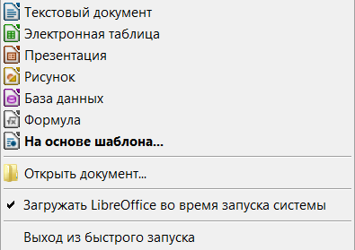

Быстрый запуск в Windows
========================

LibreOffice в процессе установки на компьютер под управлением ОС Windows устанавливает компонент Быстрый запуск (Quickstarter). Меню быстрого запуска устанавливается в системный трей Windows (рядом с часами в правом нижнем углу) и автоматически загружается при старте операционной системы. При старте операционной системы он  загружает в оперативную память библиотеки *.DLL необходимые для работы LibreOffice, в результате достигается ускорение запуска компонентов LibreOffice. Если Быстрый запуск  был отключен, то смотрите раздел «Активация Быстрого запуска после отключения» для его включения.

   
   